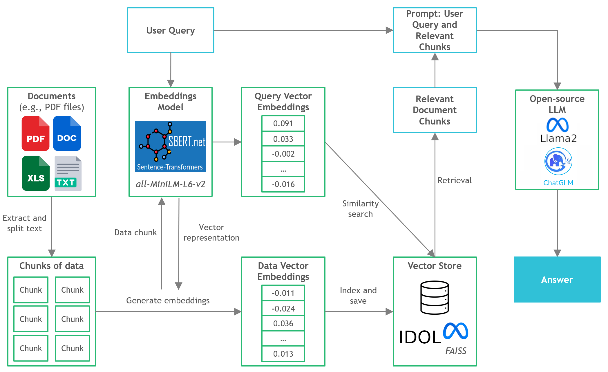
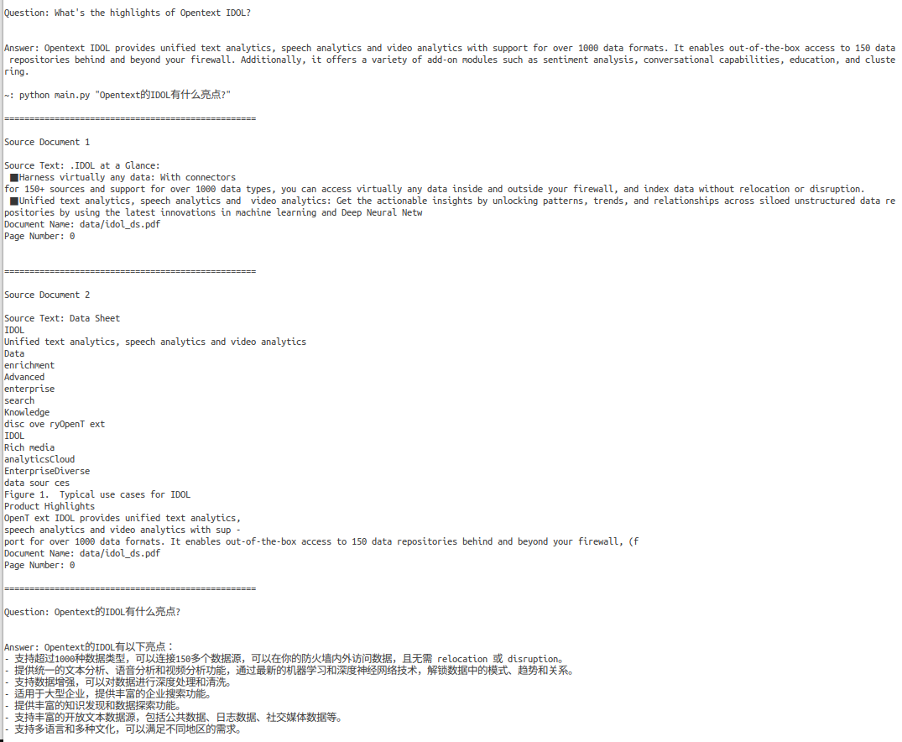

# Document Q&A with LLMs Locally
___

## Context
- Third-party commercial large language model (LLM) providers like OpenAI's GPT4 have democratized LLM use via simple API calls. 
- However, there are instances where teams would require self-managed or private model deployment for reasons like data privacy and residency rules.
- The proliferation of open-source LLMs has opened up a vast range of options for us, thus reducing our reliance on these third-party providers.
- When we host open-source LLMs locally on-premise or in the cloud, the dedicated compute capacity becomes a key issue. While GPU instances may seem the obvious choice, the costs can easily skyrocket beyond budget.
- In this project, we will discover how to run quantized versions of open-source LLMs on local CPU inference for document question-and-answer (Q&A).

___

## Quickstart
- Ensure you have downloaded one of models for answer generation:
  - the GGUF binary file of English model `TheBloke/Llama-2-7b` from https://huggingface.co/TheBloke/Llama-2-7b-Chat-GGUF, with `MODEL_BIN_PATH` pointing to the location and `MODEL_TYPE: 'llama'` in `config/config.yml`.
  - the GGML binary file of Chinese-English bilingual model `THUDM/chatglm3-6b` from https://modelscope.cn/models/tiansz/chatglm3-6b-ggml/ , with `MODEL_BIN_PATH` pointing to the location and `MODEL_TYPE: 'chatglm_cpp'` in `config/config.yml`.
    You can also manually quantize it with command:
    ```bash
    # see: https://github.com/li-plus/chatglm.cpp
    python -m chatglm_cpp.convert -i THUDM/chatglm3-6b -t q4_0 -o models/chatglm3-6b-ggml.q4_0.bin
    ```
  - all files of Chinese-English bilingual model `THUDM/chatglm2-6b` from https://huggingface.co/THUDM/chatglm2-6b-int4 , with `MODEL_BIN_PATH` pointing to the location and `MODEL_TYPE: 'chatglm'` in `config/config.yml`.

- Ensure you have downloaded one of models for text embeddings:
  - all files of English model `sentence-transformers/all-MiniLM-L6-v2` from https://huggingface.co/sentence-transformers/all-MiniLM-L6-v2, with `EMBEDDINGS_MODEL` pointing to the location in `config/config.yml`.
  - all files of multilingal model `sentence-transformers/paraphrase-multilingual-MiniLM-L12-v2` from https://huggingface.co/sentence-transformers/paraphrase-multilingual-MiniLM-L12-v2, with `EMBEDDINGS_MODEL` pointing to the location in `config/config.yml`.

- Put your docs in `data/` directory, launch the terminal from the project directory and run the following command to index:
  ```bash
  python db_build.py
  ```

- To start parsing user queries into the application, run command`python main.py "<user query>".`For example, `python main.py "What is the minimum guarantee payable by Adidas?"`
  
___
## Tools
- **LangChain**: Framework for developing applications powered by language models
- **C Transformers**: Python bindings for the Transformer models implemented in C/C++ using GGML or GGUF library
- **ChatGLM.cpp**: C++ implementation of [ChatGLM-6B](https://github.com/THUDM/ChatGLM-6B), [ChatGLM2-6B](https://github.com/THUDM/ChatGLM2-6B), [ChatGLM3-6B](https://github.com/THUDM/ChatGLM3) and more LLMs for real-time chatting on your MacBook.
- **FAISS**: Open-source library for efficient similarity search and clustering of dense vectors.
- **Sentence-Transformers (all-MiniLM-L6-v2)**: Open-source pre-trained transformer English model for embedding text to a 384-dimensional dense vector space for tasks like clustering or semantic search.
- **Sentence-Transformers (paraphrase-multilingual-MiniLM-L12-v2)**: Open-source pre-trained transformer multilingual model for embedding text to a 384-dimensional dense vector space for tasks like clustering or semantic search.
- **Llama-2-7B-Chat**: Open-source fine-tuned Llama 2 model designed for chat dialogue. Leverages publicly available instruction datasets and over 1 million human annotations. 
- **ChatGLM3-6B**: Open-source Chinese-English bilingual model popular in Chinese community.

___
## Files and Content
- `/assets`: Images relevant to the project
- `/config`: Configuration files for LLM application
- `/data`: Dataset used for this project (i.e., Manchester United FC 2022 Annual Report - 177-page PDF document)
- `/models`: Binary file of GGML or GGUF quantized LLM model (i.e., Llama-2-7B-Chat) 
- `/src`: Python codes of key components of LLM application, namely `llm.py`, `utils.py`, and `prompts.py`
- `/vectorstore`: FAISS vector store for documents
- `db_build.py`: Python script to ingest dataset and generate FAISS vector store
- `main.py`: Main Python script to launch the application and to pass user query via command line
- `requirements.txt`: List of Python dependencies (and version)
___

## References
- https://github.com/langchain-ai/langchain
- https://github.com/marella/ctransformers
- https://github.com/li-plus/chatglm.cpp
- https://huggingface.co/TheBloke/Llama-2-7b-Chat-GGUF
- https://huggingface.co/THUDM/chatglm2-6b-int4
- https://huggingface.co/THUDM/chatglm3-6b
